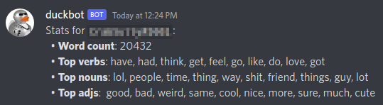
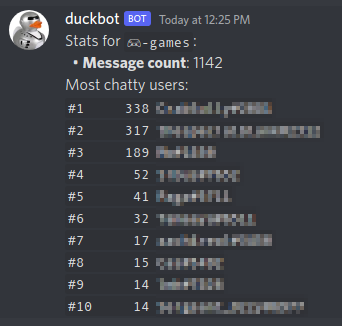
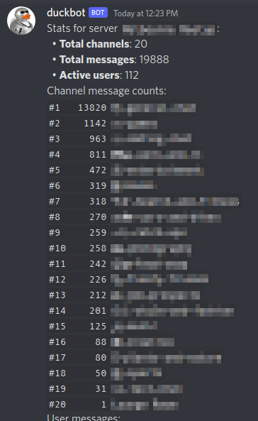

# Duckbot: Discord Chat Stats Bot

## Features

 * Stats per user (message counts; word counts including _nouns, verbs and adjectives_) 
 * Stats per channel (message counts; chatty users)
 * Stats per server (message counts; chatty users)
 * [CapyCoin](https://github.com/lmartinking/capycoin) integration (optional!)

## Screenshots

## Privacy

This bot records statistics and does **NOT** record whole messages.

However, it will tokenise messages into words and classify them, and store
those tokens and a count (per user). These are stored in the `userwords` table.

The bot maintains a `users` table and a `channels` table which contains
the ID and name of those discord objects.

The `messages` table contains the Message ID, Channel ID, User ID and
Timestamp of the message.

## Requirements

 * Python 3.8+
 * Poetry <https://python-poetry.org/docs>
 * KX kdb+ (Personal use licences are available free of charge from
   <https://code.kx.com/q/learn/licensing>)

 1. Run `python -m venv .venv` to create a virtualenv
 2. Run `poetry install`
 3. Run `source .venv/bin/activate`
 4. Run `python -m spacy download en_core_web_sm`

## Discord Bot Setup

You should follow the steps provided by `discord.py` to set up a
Discord application and token: <https://discordpy.readthedocs.io/en/stable/discord.html#discord-intro>

These instructions are quite involved, and it is recommended you invite the
bot into a personal testing server first.

Please do not add this bot into a server without understanding the privacy
implications. Even though a discord server could be considered a public forum,
it is good manners to obtain an understanding from the server community before
adding this bot.

## Configuration

Configuration is via environment variables. By default `run-bot.sh` and `run-kdb.sh`
will source `.env` as part of their startup.

 * `DUCKBOT_TOKEN`: Discord bot token.
 * `DUCKBOT_LANG_MODEL`: If you wish to use a different spacy language model,
   you can set this. Defaults to `en_core_web_sm`. This model is fairly simple
   but it is also compact in terms of memory/disk usage.

 * `KDB_HOST`: kdb+ server host (defaults to `localhost`)
 * `KDB_PORT`: kdb+ server IPC port (defaults to `5000`) 
 * `KDB_USER`: kdb+ auth user (defaults to _None_)
 * `KDB_PASS`: kdb+ auth password (defaults to _None_)

 * `KDB_Q_PATH`: Path to kdb+ `q` binary. Used by `run-kdb.sh`.

 * `FORTUNE_PATH`: Path to `fortune` binary. Defaults to `/usr/games/fortune`.

 * `CAPYCOIN_HOST`: URL to a CapyCoin gateway. See: https://github.com/lmartinking/capycoin
 * `CAPYCOIN_USERS_DB_PATH`: Path for SQLite database file used for Discord User
   to CapyCoin account ID mapping

## Quickstart

 1. Set up discord application (per above). Invite bot to server(s).
 2. Follow instructions under [requirements](#requirements) (in a terminal)
 3. Copy `env.example` to `.env` and edit
 4. `$ ./run-kdb.sh` (in one terminal)
 5. `$ ./run-bot.sh` (in another terminal)

## Commands

 * `@duckbot help` - the bot will print a help overview to the channel
 * `@duckbot stats @user` - print stats for a particular user
 * `@duckbot stats #channel` - print stats for a particular channel
 * `@duckbot stats server` - print stats for the whole server
 * `@duckbot fortune` - send a fortune to the current channel
 * `@duckbot ping` - the bot will respond "pong" to the user

## CapyCoin Commands

These commands are only enabled when `CAPYCOIN_HOST` is set.

 * `@duckbot coin signup` - sign up for a CapyCoin account
 * `@duckbot coin send @user {amount}` - send coin to a user
 * `@duckbot coin funds` - show your account funds

## Licence

This code is licenced under the GPLv2.
